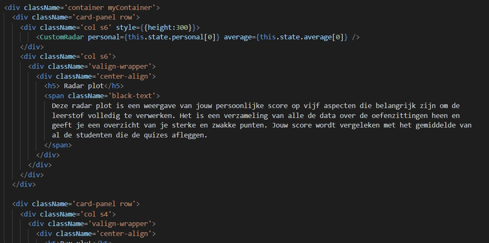
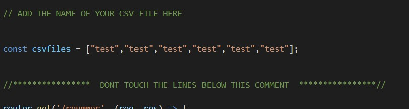

# Installeren van de dependencies
- navigeer naar de folder 'feedback-frontend'
- run 'npm install'

- navigeer naar de folder 'feedbavk-server'
- run 'npm install'

# Reactjs app starten

- open folder 'feedback-frontend'
- run 'npm start' in terminal
- op 'localhost:3000' in de brower is nu de app te zien

# Server starten

- open folder 'feedback-server'
- run 'npm start' in terminal
- de server runt op poort 9000, maar de link met de frontend is al in orde. Je moet naast het opstarten niets meer toevoegen.

# De grafieken aanpassen

- Kies een rnummer hash. Deze zijn te vinden in de csv-files op de server als eerste entry (Zie **Keuze van oefenzittingen**).
- Vul rechtsboven in de bovenbalk de hash in en druk op 'Submit'. Normaal zijn de grafieken nu aangepast.

# Reactjs app bewerken

In 'feedback-frontend/src/compontents/App/App.jsx' is de hoofdpagina te vinden. Tussen lijn 67 en 177 zijn de verschillende teskstjes te vinden die getoond worden aan de studenten. Aan de rest van de code moet je normaal niet meer komen.

 

# Keuze van oefenzittingen

In 'feedback-server/oefenzittingen/' staan alle csv-files per oefenzitting die verwerkt zijn door 'data-fetching' (**Hier moet je dus niet de excel-bestanden van de oefenzittingen plaatsen**). 

In 'routes/index.js' staat de code voor de server. Om andere oefenzittingen te tonen moet de array op lijn 11 aangepast worden. De volgorde is belangrijk (eerste entry is oefenzitting 1, tweede is oefenzitting 2, etc.). De string verwijst naar de naam van één van de csv-files in het mapje oefenzittingen. Als dit niet zo is zal de server een error geven.

 

